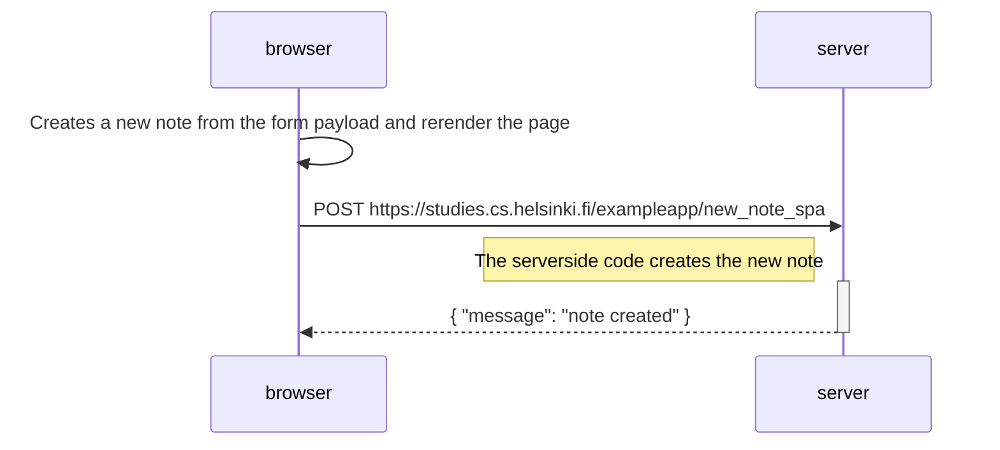

```mermaid
sequenceDiagram
    participant browser
    participant server

    browser->>browser: Creates a new note from the form payload and rerender the page
    
    browser->>server: POST https://studies.cs.helsinki.fi/exampleapp/new_note_spa
    Note left of server: The serverside code creates the new note
    activate server
    server-->>browser: { "message": "note created" }
    deactivate server
```